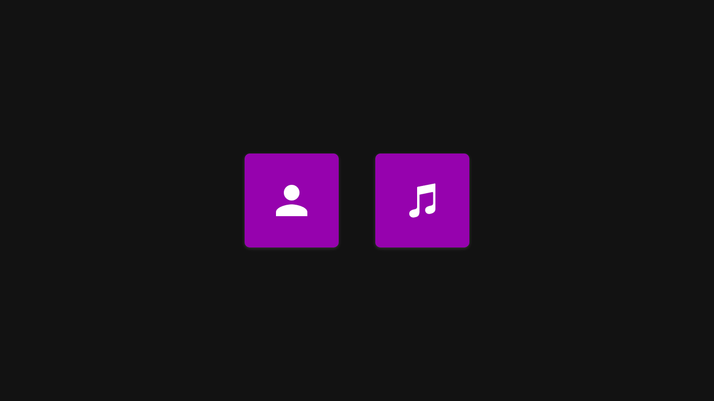
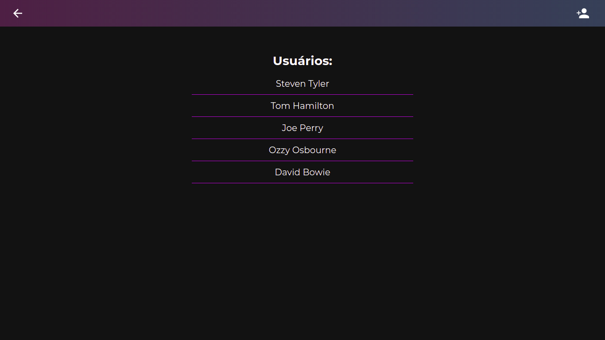
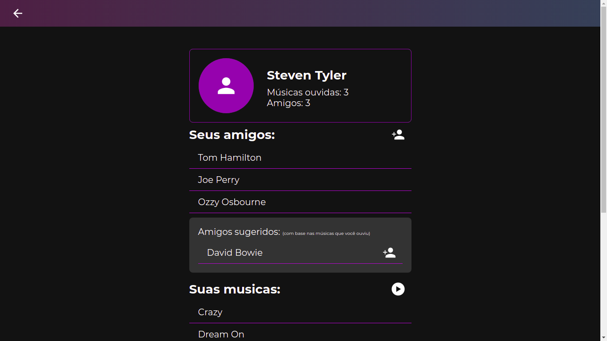
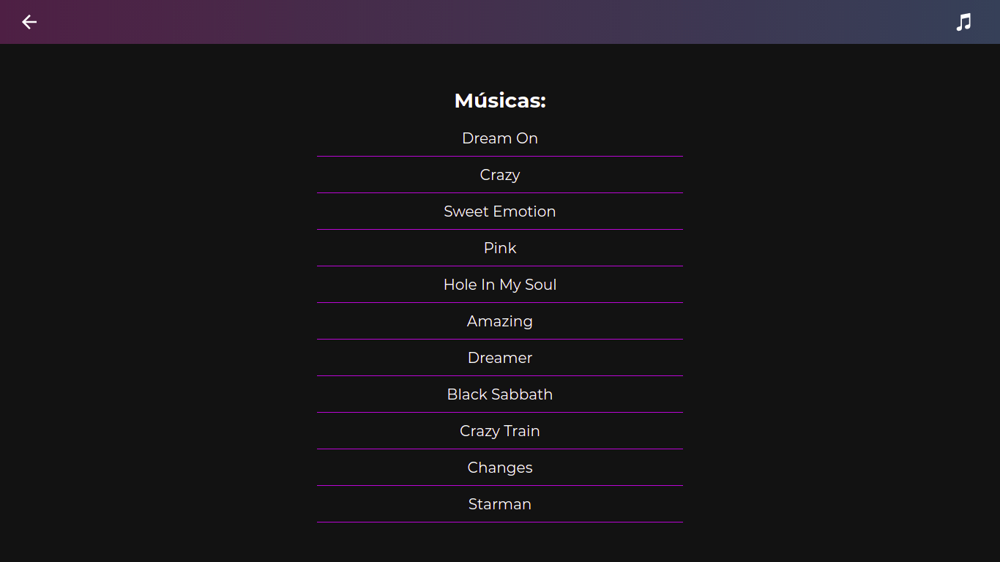

# Spotfga

**Número da Lista**: 6<br>
**Conteúdo da Disciplina**: Trabalho final<br>

## Alunos
|Matrícula | Aluno |
| -- | -- |
| 18/0016938  |  Gabriel Paiva Aguiar |
| 18/0025601 |  Murilo Gomes de Souza |

## Sobre 
Esse projeto pretende simular uma rede social, contento funcionalidades que envolvem o uso de algorítmos relacionados à Grafos e Programação Dinâmica.

Os principais usos desses algorítmos foram:

* Grafos para representação dos usuários e suas relações de amizade.

* Busca em Largura (BFS) associada ao algoritmo de Maior Subsequência Comum (LCS) para gerar sugestões de amizades e músicas que os usuários da rede podem consumir.

Essas e outras funcionalidades menores do projeto serão descritos abaixo das screenshots de cada tela.

## Screenshots e Uso

<br>

 <br> <br>

Na tela inicial é possível alcançar a tela de usuários ou músicas clicando nos botões apresentados.

<br>

 <br> <br>

Na tela de usuários há uma listagem dos usuários cadastrados. Para facilitar o teste do projeto, já deixamos algumas informações cadastradas previamente em um mockup. Também é possível cadastrar novos usuários manualmente clicando no botão da barra de navegação superior da tela.

Na listagem de usuários, é possível escolher um deles, clicando em seu nome, para ver seu perfil.

<br>

 <br> <br>

Essa tela simula o perfil de um usuário. Aqui se concentram as funcionalidades importantes para a disciplina Projetos de Algorítmos, que são disparadas logo ao carregar a página:

* As informações contidas no nó do usuário são mostradas na tela.

* As arestas do grafo são carregadas, representando as amizades do usuário.

* Os algorítmos de BFS e LCS são disparados para gerar as sugestões de músicas e amizades.

Nessa página também é possível:

* Adicionar um novo amigo (pelas sugestões ou buscando em todos os usuários cadastrados).

* Adicionar uma nova música escutada (pelas sugestões ou buscando em todas as músicas cadastradas).

**Ao adicionar um novo amigo ou escutar uma nova música, as sugestões serão recalculadas, mostrando sempre um resultado atualizado.**

<br>

 <br> <br>

Essa página só mostra a listagem das músicas cadastradas no site.

## Instalação 
**Linguagem**: Typescript<br>
**Framework**: React<br>
Para rodar o projeto, será necessário ter instalado em sua máquina o yarn ou npm

```
https://nodejs.org/en/
```

### Como rodar

1. Clone o projeto na sua máquina:

```
git clone https://github.com/projeto-de-algoritmos/Final_spotfga
```

2. Entre na pasta do projeto:

```
cd Final_spotfga/spotfga
```

3. Instale as dependências do projeto:

```
npm install
```

ou

```
yarn
```


4. Execute o projeto para subir o servidor:

```
npm start
```

ou

```
yarn start
```


5. Acesse o projeto no seu navegador através da url:

```
http://localhost:3000/
```

## Importante:

Os usuários ou músicas cadastrados manualmente ficarão salvos somente durante a execução do projeto. Caso o site seja recarregado ou fechado, todos esses dados serão perdidos, permanecendo somente os dados cadastrados no mockup.